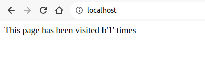

## 在網頁上，顯示拜訪次數

### 檔案架構
```
├── app
│   ├── app.py
│   └── uwsgi.ini
├── docker-compose.yml
├── kong
│   ├── kong.conf
│   └── kong.yml
├── my-kong-Dockerfile
├── my-web-Dockerfile
└── run.sh
```

### 功能
- my-redis: 快取 key/value
- my-web: 顯示拜訪次數，向 my-redis 要拜訪次數並更新
- my-kong: 代理 my-web

### 執行方式
- 執行 docker-compose.yaml 方式：
  ```
  $ docker-compose up --force-recreate
  ```
  或是
  ```
  $ sh run.sh
  ```

### 顯示結果

